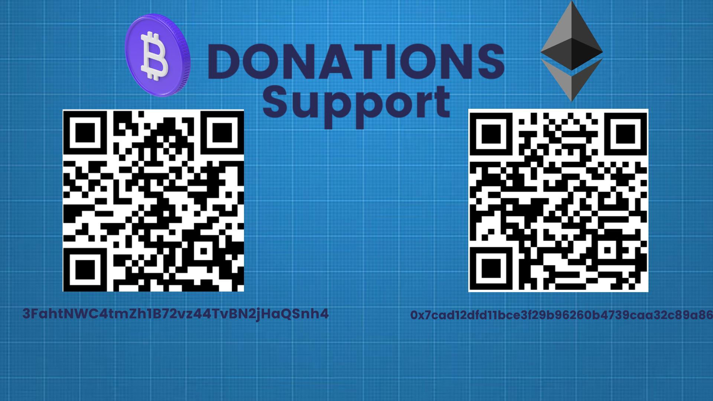

## Hello 👋 !

 

  
    

### 🖥️ Web front & back-end developer. 

# Stuff 🚀

### Langage 

    

### Framework

   

and css framework...

## 📃 List of my articles

RFR ➡️ React, Firebase, Redux

- [How to make Trello system clone whit R-F-R](https://dev.to/denspec/create-trello-clone-whit-react-firebase-redux-1ac5)
- [How to make a simple post and reply system with R-F-R](https://dev.to/denspec/how-to-create-a-simple-clone-of-devto-stackoverflow-react-firebase-redux-1dm2)

## 📝 My open source project

- [Firecord](https://github.com/DenSpec/Firecord) : Discord clone in ``React, Firebase, Redux`` and containing full documentation

## 📨 Contact~Account 
- [Twitter](https://twitter.com/DenSpec98) : ``@DenSpec98``
- [Email](mailto:contact.denspec@gmail.com) : ``contact.denspec@gmail.com``
- [DevTo](https://dev.to/denspec) : ``denspec``
- Discord : ``DenSpec#0510``

## 💲 Donation~Support

| Bitcoin | Ethereum | 
|----------------|:-------------| 
``3FahtNWC4tmZh1B72vz44TvBN2jHaQSnh4`` | ``0x7cad12dfd11bce3f29b96260b4739caa32c89a86``   | 

